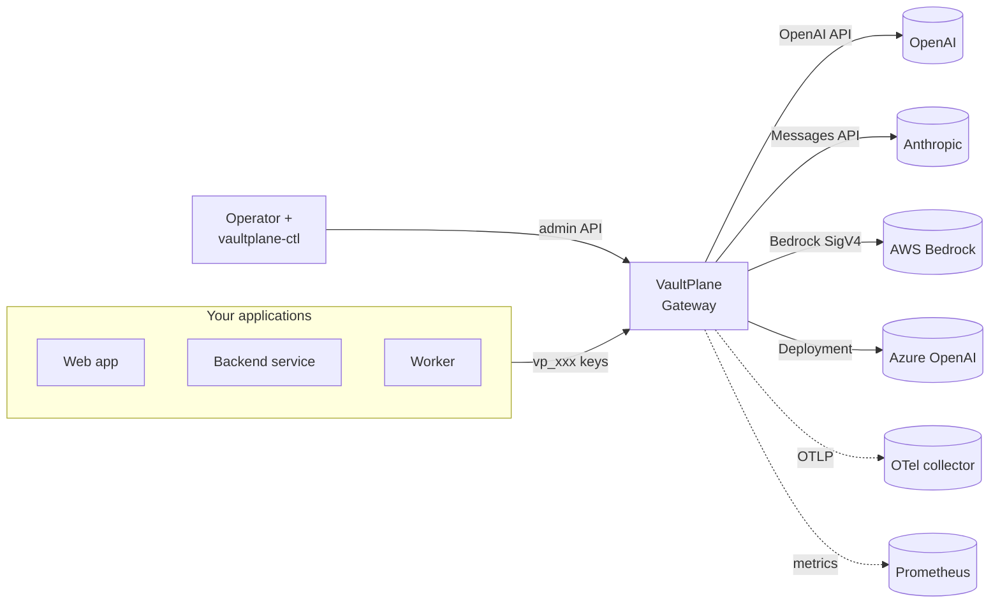

# VaultPlane Gateway

**Every model call, on policy.**

VaultPlane Gateway is an open-source proxy that sits between your applications
and every AI model provider you use, so your platform and security teams have
one place to enforce cost, access, and policy on AI traffic, and one place to
observe it.

It is the enforcement plane of [VaultPlane](https://vaultplane.com), the
control plane for AI infrastructure. The VaultPlane Registry defines what is
trusted; the Gateway enforces it on the wire.

> ⚠️ **Pre-1.0.** The runtime is shipping in the open. The surfaces below
> work end-to-end and are covered by tests, but APIs and the config schema
> may still change before 1.0. Pin to a specific commit or image tag.

---

## Why a gateway

Most engineering organizations end up with AI traffic that looks like this:

* every team has wired up the SDK for whichever provider they chose
* nobody can answer "what did we spend on AI last month, by team?" without a
  weekend of pulling provider invoices and reconciling them by API key
* nobody can answer "did any of our outbound calls contain customer PII?"
* if OpenAI has an outage, every product built on it stops working
* rotating an API key means coordinating across every service that uses it

VaultPlane Gateway gives you a single chokepoint for that traffic. Apps speak
to the Gateway using the OpenAI Chat Completions and Embeddings APIs they
already know. The Gateway authenticates each call against a virtual key
(scoped to a team, app, and environment), routes to the right upstream
provider with automatic failover, runs inline policy (for example PII
redaction), records cost against the key's budget, and emits one
OpenTelemetry span per request. You change models, providers, limits, or
policy by editing config and reloading. Apps do not need to know.

## Where it sits in your stack



Apps hold virtual keys (`vp_...`), not provider keys. Provider credentials
live only on the Gateway. The proxy port (default 8080) serves the
OpenAI-compatible API to your apps. The admin port (default 9091) is for
operators: issue keys, reload config, scrape metrics, check health. The two
ports separate so you can expose the proxy to your application network while
keeping admin on a tighter perimeter.

## What you get out of the box

* **One OpenAI-compatible endpoint** for every provider you use. Apps point
  at the Gateway and stop caring which vendor is behind which model name.
* **Multi-provider routing with automatic failover.** Define a virtual model
  (`fast`, `smart`, `coding`) and route it to a primary provider plus
  ordered fallbacks. Retryable status codes, connector errors, and timeouts
  fail over without dropping the request.
* **Virtual keys with cost and rate limits.** Issue a key per team, app, and
  environment with one command. Each key has its own per-second rate limit
  and per-period spend budget (day, week, or month). Spend that exceeds the
  budget is rejected before the upstream is called.
* **Inline policy on every request.** Plugins run on the request body
  before it leaves your network. WebAssembly components run in a sandbox
  through an embedded wasmtime host with a hard per-plugin latency budget
  and a fail-open or fail-closed circuit breaker. The reference
  PII-redaction plugin ships as one of these; a built-in native version is
  also available.
* **Production observability with zero extra wiring.** Every request is one
  OpenTelemetry span with GenAI semantic-convention attributes plus
  `vaultplane.*` attributes for the virtual key, team, app, env, and cost.
  Prometheus metrics for request rate, latency, cost, and rejection
  reasons. Cardinality is bounded by design.
* **An audit trail you can filter.** Every administrative action and policy
  decision (key created or revoked, config reloaded, plugin loaded, request
  rejected by a plugin, provider failover) is emitted as a structured event
  tagged `vaultplane.audit=true`, on the OTLP logs pipeline alongside the
  rest of your telemetry.
* **Operate without restarts.** TLS certs hot-rotate. Config hot-reloads via
  SIGHUP or the admin API. Atomic swap: failed validation keeps the old
  config running.
* **Self-host on anything.** Single static-ish binary, or a distroless
  container image (~25 MB) published to GHCR.

---

## Table of contents

* [Try it in 60 seconds](#try-it-in-60-seconds)
* [Production quick start](#production-quick-start)
* [Run with Docker](#run-with-docker)
* [Examples](#examples)
* [Configuration](#configuration)
* [Proxy API](#proxy-api-v1)
* [Admin API](#admin-api-admin)
* [vaultplane-ctl](#vaultplane-ctl)
* [Observability](#observability)
* [How it works internally](#how-it-works-internally)
* [VaultPlane: two planes](#vaultplane-two-planes)
* [License](#license)

---

## Try it in 60 seconds

The fastest way to see it work: run the Gateway with default settings
against your own OpenAI key, then call it from a second terminal as if it
were OpenAI. No config file, no virtual keys, open admin (don't do this in
production, but fine on localhost).

```bash
docker run --rm -p 8080:8080 \
  -e OPENAI_API_KEY \
  ghcr.io/vaultplane/vaultplane-gateway:main
```

In another shell:

```bash
curl http://localhost:8080/v1/chat/completions \
  -H "Content-Type: application/json" \
  -d '{
    "model": "gpt-4o",
    "messages": [{"role": "user", "content": "say hi in five words"}]
  }'
```

That's it. With no virtual keys configured, the Gateway is open (no
`Authorization` header needed) and forwards the request to OpenAI. The
model name (`gpt-4o`) routes to OpenAI by prefix because the registry is
empty. Add a config file and virtual keys when you're ready to lock it
down.

## Production quick start

For anything beyond localhost you want: a config file, a non-empty key
store, an admin token, TLS, and a Prometheus scrape. Build from source,
pull the image (see [Run with Docker](#run-with-docker)), or download a
prebuilt binary.

Tagged releases (`vX.Y.Z`) attach static binaries for Linux (amd64, arm64)
and macOS (arm64) to the GitHub Release, each archive bundling both
`vaultplane` and `vaultplane-ctl` alongside a `SHA256SUMS` file, plus the
reference PII plugin `pii_redaction.wasm`.

```bash
# From source: build the gateway and the operator CLI.
cargo build --release -p vaultplane -p vaultplane-ctl

# Provider keys (whichever upstreams you actually use).
export OPENAI_API_KEY=sk-...
export ANTHROPIC_API_KEY=sk-ant-...

# Admin token: the bearer the admin port (default 9091) checks for.
export VAULTPLANE_ADMIN_TOKEN=$(openssl rand -hex 32)

# Run with your config.
./target/release/vaultplane --config vaultplane.yaml
```

Issue your first virtual key (the only time the plaintext is shown):

```bash
./target/release/vaultplane-ctl \
  --endpoint http://localhost:9091 \
  key create --team core --app web --env prod --model gpt-4o
```

Hand the printed `vp_...` token to the calling application and configure it
to send `Authorization: Bearer vp_...` to the Gateway instead of the
provider's own API key. The Gateway swaps in the upstream credential at
the edge.

## Run with Docker

Published images live at `ghcr.io/vaultplane/vaultplane-gateway`. Every
push to `main` produces a new image; tagged releases (`vX.Y.Z`) get semver
tags plus `latest`.

```bash
docker pull ghcr.io/vaultplane/vaultplane-gateway:main

docker run --rm -p 8080:8080 -p 9091:9091 \
  -e OPENAI_API_KEY \
  -e VAULTPLANE_ADMIN_TOKEN \
  -v "$(pwd)/vaultplane.yaml:/etc/vaultplane/vaultplane.yaml:ro" \
  ghcr.io/vaultplane/vaultplane-gateway:main \
  --config /etc/vaultplane/vaultplane.yaml
```

The image is built from `gcr.io/distroless/cc-debian12:nonroot`: no shell,
no package manager, runs as the non-root user (UID 65532). Published for
linux/amd64 and linux/arm64.

## Examples

Self-contained docker-compose stacks live in [`examples/`](./examples/):

| Example | What it shows |
| --- | --- |
| [`quickstart`](./examples/quickstart) | Gateway against OpenAI with caching, `docker compose up` and `curl`. |
| [`observability`](./examples/observability) | Gateway + Jaeger + Prometheus on one network. Open the Jaeger UI to see one trace per request; open the Prometheus UI to query latency, cost, and rejection metrics. |

Each example has its own README with the run command and the relevant
PromQL queries. Both run with no virtual keys and no admin token to keep
the example surface small; production setup is in the rest of this README.

For Kubernetes, a Helm chart lives under [`charts/vaultplane/`](./charts/vaultplane/)
with two-port Service, ConfigMap, Secret, optional ServiceMonitor, and a
PodDisruptionBudget.

## Configuration

Configuration is layered: defaults, then an optional YAML file passed with
`--config`, then environment variables prefixed `VAULTPLANE_` (nested keys
split on `__`). Validate before reloading with
`vaultplane-ctl config validate vaultplane.yaml`. Every field, type,
default, and hot-reload status is documented in
[CONFIGURATION.md](./CONFIGURATION.md).

A representative file:

```yaml
listen:
  address: "0.0.0.0:8080"
  admin_address: "0.0.0.0:9091"
  tls:
    cert_path: "/etc/vaultplane/cert.pem"
    key_path: "/etc/vaultplane/key.pem"

providers:
  openai:
    base_url: "https://api.openai.com"
    api_key_env: "OPENAI_API_KEY"
  anthropic:
    base_url: "https://api.anthropic.com"
    api_key_env: "ANTHROPIC_API_KEY"

models:
  - name: smart
    primary: { provider: openai, model: gpt-4o }
    fallbacks:
      - { provider: anthropic, model: claude-3-7-sonnet }
    retry_on: [502, 503, 504]
    timeout_ms: 30000

cache:
  enabled: true
  size_mb: 64
  ttl_seconds: 300

plugins:
  - type: pii_redaction
    patterns: [ssn, credit_card, phone_us, email]
    replacement: "[REDACTED]"
  - type: wasm
    name: pii-redaction
    path: /etc/vaultplane/plugins/pii_redaction.wasm
    latency_budget_ms: 5
    on_timeout: fail-open
```

Diff two configs before promoting:

```bash
vaultplane-ctl config diff vaultplane.yaml vaultplane.new.yaml
```

## Proxy API (`/v1/*`)

The proxy port speaks OpenAI Chat Completions and Embeddings. Authenticate
with a virtual key in `Authorization: Bearer vp_<token>`. With no keys
configured, the proxy is open (useful for local development).

| Method | Path | Notes |
| --- | --- | --- |
| POST | `/v1/chat/completions` | Streaming and non-streaming. |
| POST | `/v1/embeddings` | OpenAI and Azure today. Anthropic and Bedrock embeddings return "not supported". |
| GET | `/v1/models` | Returns the virtual models declared in `models:`. |

A virtual model name resolves through the registry: primary plus ordered
fallbacks, with automatic failover on retryable status codes, connector
errors, and timeouts. A model that is not in the registry routes by name
prefix (`claude*` to Anthropic, everything else to OpenAI). Cache hits
return with `x-vaultplane-cache: HIT`.

Two optional request headers are honored: `X-VaultPlane-Trace-Id` is recorded
on the request span (otherwise the span's own trace id stands), and
`X-VaultPlane-Idempotency-Key` keys the cache instead of the request body, so
retries with the same key share a cached response.

Provider errors are forwarded with the upstream status code, rewritten
into the OpenAI error envelope for cross-provider consistency. Connector
failures return 502 (or 504 for upstream timeouts) with
`{"error": {"message": "...", "type": "upstream_error" | "upstream_timeout"}}`.

## Admin API (`/admin/*`)

The admin API binds to a separate port (default `0.0.0.0:9091`), intended
for cluster-internal access. Protected endpoints require the bearer token
in `VAULTPLANE_ADMIN_TOKEN`; health and readiness probes are always open.

| Method | Path | Auth | Purpose |
| --- | --- | --- | --- |
| GET | `/admin/healthz` | open | Liveness probe (the process is up). |
| GET | `/admin/readyz` | open | Readiness probe: 200 once config is loaded and at least one configured provider is reachable, 503 otherwise. |
| GET | `/admin/status` | token | Version, uptime, key count. |
| GET | `/admin/metrics` | token | Prometheus text format. |
| GET | `/admin/keys` | token | List virtual keys (no hashes returned). |
| POST | `/admin/keys` | token | Issue a new key (returns plaintext token once). |
| DELETE | `/admin/keys/{id}` | token | Revoke a key and free its rate/spend state. |
| GET | `/admin/keys/{id}/spend` | token | Current-period spend and remaining budget for a key. |
| GET | `/admin/models` | token | List the configured virtual models and their providers. |
| POST | `/admin/config/reload` | token | Reload config and rotate certs in place. |

## `vaultplane-ctl`

The operator CLI talks to the admin API over HTTP and is the recommended
way to manage keys, validate config, and inspect status. With `--endpoint`
set (or the `VAULTPLANE_ADMIN_ENDPOINT` environment variable), every
command targets the running gateway. The admin token is read from
`--token` or `VAULTPLANE_ADMIN_TOKEN`.

```bash
vaultplane-ctl --endpoint http://localhost:9091 status
vaultplane-ctl key list
vaultplane-ctl key create --team core --app web --env prod \
  --model gpt-4o --rps 10 --spend 500/day
vaultplane-ctl key revoke vp_AbCdEfGhIjKl

vaultplane-ctl model list

vaultplane-ctl config validate vaultplane.yaml
vaultplane-ctl config diff vaultplane.yaml vaultplane.new.yaml
```

Without `--endpoint`, `key create` falls back to an offline mode: it
generates a key locally and prints a YAML record to paste into `auth.keys`
for bootstrap.

## Observability

Every request is recorded as a tracing span with OpenTelemetry GenAI
semantic-convention attributes (`gen_ai.system`, `gen_ai.request.model`,
`gen_ai.usage.input_tokens`, ...) plus `vaultplane.*` attributes for the
virtual key, team, app, env, cost, and cache hit. Set
`OTEL_EXPORTER_OTLP_ENDPOINT` to forward both spans (to `/v1/traces`) and
logs (to `/v1/logs`) to a collector. The Gateway does not embed the
OpenTelemetry Collector; run it as a sidecar.

Ready-to-edit Collector presets for Dynatrace, Datadog, Splunk Observability,
New Relic, Grafana Cloud, Elastic, and Honeycomb live in
[`integrations/`](./integrations), along with a Dynatrace dashboard and setup
guide and the Rubrik Agent Rewind audit feed.

### Audit log

Administrative actions and policy decisions are emitted as structured events
on the `vaultplane::audit` tracing target, each tagged `vaultplane.audit=true`
with canonical `action`, `actor`, `subject`, and `outcome` fields plus
action-specific metadata. The audited actions are `key.create`, `key.revoke`,
`config.reload`, `plugin.load`, `plugin.reject`, and `failover`. They flow out
over the OTLP logs pipeline when an endpoint is set, and appear in the local
log stream otherwise. Filter on the `vaultplane.audit` field (or the
`vaultplane::audit` target) to isolate the audit stream. Audit retention,
search, and a UI are control-plane (Cloud) capabilities; the open-source
Gateway emits the stream and you store it wherever you like.

Prometheus metrics at `/admin/metrics`:

| Series | Type | Labels |
| --- | --- | --- |
| `vaultplane_requests_total` | counter | `provider, model, status` |
| `vaultplane_request_duration_seconds` | histogram | `provider, model, cache` |
| `vaultplane_cost_cents_total` | counter | `provider, model` |
| `vaultplane_rejections_total` | counter | `reason` |

Cost is in integer cents (the `metrics` crate is integer-only); divide by
100 in dashboards for dollars. Rejection reasons are `auth`, `expired`,
`rate_limit`, `spend_limit`, `forbidden_model`, `plugin`, and
`upstream_error`.

Label cardinality is bounded by design. Virtual key id, team, app, and
env go on the OTel spans (which are sampled and cardinality-safe), not on
the metrics labels, so multi-tenant load does not explode the registry.

---

## How it works internally

A short tour for engineers who want to understand the data plane before
contributing or extending it. The PRD has the full architectural contract;
this section sketches the load-bearing decisions.

### Stateless data plane

The Gateway holds no per-request state across instances. Virtual keys,
rate-limit buckets, and per-period spend accumulators live in memory on
each replica; the design is for them to move to the Cloud control plane
(out of scope for this repo) for cross-replica consistency. Today, run a
single replica or partition traffic to a sticky replica per virtual key.

### Provider connectors

Every upstream family is reached through a single `Connector` trait
implemented once per family (`openai`, `anthropic`, `azure`, `bedrock`).
Adding a provider means writing one new file and registering it in the
runtime; the rest of the codebase does not change. The trait returns a
`BodyStream`, so streaming responses are forwarded chunk by chunk without
the Gateway ever buffering the full response.

### Model registry and failover

A virtual model name (`smart`) resolves to a list of routes: a primary
provider plus ordered fallbacks. The dispatcher tries each route in order,
failing over on retryable status codes (configurable per model), connector
errors, and timeouts. The response carries an `attempts` count so the OTel
span reflects how many providers were tried.

### Schema translation

Anthropic and Bedrock requests are translated to and from the OpenAI Chat
Completions schema, including streaming: Anthropic's native SSE event
stream is rewritten on the fly into OpenAI Chat Completions chunks. Error
responses are also rewritten into the OpenAI error envelope so clients see
a consistent shape regardless of which upstream actually served the
request.

### Hot-swappable runtime

Connectors, the model registry, the pricing table, the cache, and the
plugin chain are bundled into a single `Runtime` struct held in an
`ArcSwap`. Each request `.load()`s the current snapshot once at the top of
the handler and holds it for the rest of the request. A reload (SIGHUP or
`POST /admin/config/reload`) validates the new configuration, builds a
fresh `Runtime`, reloads TLS material, and atomically swaps the handle.
In-flight requests keep the snapshot they already loaded; the next request
sees the new one. Failed validation leaves the old runtime active.

### Persistent state

The keystore, rate limiter, and spend tracker are deliberately NOT part of
the runtime swap. They hold per-key state that accumulates over time
(admin-issued keys, rate-limit buckets, period spend totals); wiping them
on every reload would be surprising. They live behind their own
synchronization primitives (an `RwLock` for the keystore, `Mutex`-protected
maps for the limiter and tracker).

### Inline plugins

A plugin chain runs on each chat and embeddings request between the spend
pre-check and the cache lookup. Plugins decide
`Pass | Modify(body) | Reject(reason)` and can be bound to specific routes.
Two implementations share the same trait: a built-in native plugin and the
WebAssembly host. The host embeds wasmtime (Component Model), loads any
component implementing the `inspect-request` WIT contract, runs it in a WASI
sandbox with a fresh store per call, and enforces each plugin's latency
budget with an epoch-deadline trap, failing open or closed per the route
policy. The reference PII-redaction plugin ships as a WebAssembly component.

### Auth and accounting

Virtual keys (`vp_` prefix) are 32 random bytes, hashed at rest with
SHA-256 (high-entropy tokens do not need argon2id; we explicitly chose not
to gate every request on a 10ms verify). Each key carries optional rate
limit (RPS), spend limit (USD per day/week/month), and expiry. Pricing is
configured per provider and model and applied to upstream usage to compute
per-request cost, which is recorded on the OTel span and against the
key's spend tracker.

### Observability

The Gateway uses `tracing` with the OpenTelemetry SDK. Spans are emitted
via OTLP to whatever endpoint `OTEL_EXPORTER_OTLP_ENDPOINT` points at, and a
logs bridge (`opentelemetry-appender-tracing`) exports every tracing event,
including the audit stream, as OTLP logs to the same endpoint. Prometheus
metrics use the `metrics` crate facade with `metrics-exporter-prometheus`;
the recorder is installed once at startup and rendered on demand by the admin
endpoint. The Gateway does not embed the OpenTelemetry Collector or run its
own Prometheus server.

---

## VaultPlane: two planes

VaultPlane is the control plane for AI infrastructure, split into two
planes:

* **VaultPlane Registry**: the definition plane. Discover, evaluate,
  certify, and govern MCP servers and AI skills. Browse it at
  https://vaultplane.com.
* **VaultPlane Gateway** (this repository): the enforcement plane. Routes
  and governs model and tool traffic on every call.

Policy defined in the Registry is enforced by the Gateway: define trust
once, enforce it everywhere.

## License

[Apache License 2.0](LICENSE).

---

Looking for a managed control plane? See https://vaultplane.com/cloud.
